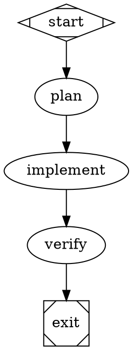

Workflows can now set graph-level `on_failure="exit"` to stop after a failed
node when no explicit recovery route matches. Fabro skips the unconditional
edge, checks configured retry targets, and ends the run as failed if no retry
target exists.

The default `on_failure="route"` preserves existing workflow behavior.

A node can also set its own `on_failure` to override the graph policy in
either direction: a best-effort node can use `on_failure="route"` inside an
`exit` graph, or a single critical node can use `on_failure="exit"` while the
rest of the graph keeps the default.

