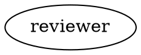

Every workflow run has a **context** — a shared key-value store that carries data between stages. When an agent writes code, a command captures test output, or a human makes a selection, the results are recorded as context updates. Downstream nodes can read these values to make decisions, build prompts, and route execution.

## How context flows

The context starts empty at the beginning of a run. As each stage completes, its outcome includes a set of **context updates** — key-value pairs that are merged into the shared context. Later stages see all updates from earlier stages.

```
Start → Plan → Implement → Test → Exit
         │         │          │
         │         │          └─ sets command.output
         │         └─ sets response.implement, last_response
         └─ sets response.plan, last_response
```

Context is thread-safe and shared across the entire run. Parallel branches receive an isolated **deep copy** of the context at the point of fan-out, so branches can't interfere with each other. The parallel handler gathers their results under `parallel.results`.

## How agents access context

Agents do not have a tool to query the context store directly. Instead, context is made available through two mechanisms:

- **Preamble injection** — When a node starts, Fabro assembles a preamble from the current context and prepends it to the node's prompt. The [fidelity setting](#fidelity-controlling-agent-context) controls how detailed this preamble is.
- **Context updates** — Agents can write to the context by including a `context_updates` object in a JSON response. See [Transitions](/workflows/transitions#agent-transitions) for the response format.

## Keys set by handlers

Each handler type writes specific keys into the context after execution:

### Agent and prompt nodes

| Key | Value |
|---|---|
| `last_stage` | The node ID of the stage that just completed |
| `last_response` | Truncated LLM response (first 200 characters) |
| `response.{node_id}` | Full LLM response text |

Agents can also emit arbitrary context updates by including a JSON object with a `context_updates` field in their response. See [Transitions](/workflows/transitions#agent-transitions).

The `review_target` key has an optional typed convention for human review
workflows. A human gate with `review_target=true` reads this exact flat key and
presents its document URL as the primary question link. See
[Review targets](/workflows/human-in-the-loop#review-targets).

### Command nodes

| Key | Value |
|---|---|
| `command.output` | The command's ordered output stream. Durable context stores this as a `blob://sha256/...` ref after the command completes; downstream prompts resolve it back to text. |

### Human gates

| Key | Value |
|---|---|
| `human.gate.selected` | The accelerator key (e.g. `"A"`) or `"freeform"` |
| `human.gate.label` | The full label of the selected edge |
| `human.gate.text` | The user's freeform text (if applicable) |
| `human.gate.<node>.question` | The question text for a specific human gate node |
| `human.gate.<node>.answer` | The answer text for a specific human gate node |
| `human.gate.<node>.label` | The selected label for a specific human gate node, when applicable |

### Parallel fan-out and fan-in

| Key | Value |
|---|---|
| `parallel.results` | Ordered branch results. Each entry contains `id`, `index`, optional `item_label`, `status`, and the branch's isolated `context_updates`. Legacy results may omit `index`. |
| `parallel.branch_count` | Number of branches dispatched. For `for_each`, this is the runtime array length. |

Branch updates remain nested inside `parallel.results`; they are not merged into top-level context. Prompted fan-in nodes can synthesize the complete result array, while promptless fan-in nodes act as barriers.

### Runtime arrays with `for_each`

A parallel node can read a flat context key and run one agent or prompt target
per array item:

```dot
batch [shape=component, for_each="context.candidates"]
batch -> reviewer
```

`context.candidates` first checks the exact key and then falls back to
`candidates`. The source must be a JSON array, either inline or stored behind a
Fabro-managed `blob://` or `file://` reference. General nested lookup such as
`output.scan.candidates` is not supported; have the producing node write the
array to a flat context key such as `candidates`.

Each item receives a separate context fork, while `(id, index)` identifies its
result. The item itself is not copied into `parallel.results`.

### Engine-managed keys

The engine sets several keys automatically. These are prefixed with `internal.` and are excluded from preambles:

| Key | Value |
|---|---|
| `internal.run_id` | Unique identifier for this run |
| `internal.work_dir` | Working directory path |
| `internal.fidelity` | The resolved fidelity mode for the current node |
| `internal.thread_id` | Thread ID for shared-conversation nodes (or null) |
| `internal.node_visit_count` | How many times the current node has been visited |
| `internal.retry_count.{node_id}` | Number of retry attempts used by a node |
| `outcome` | Status of the last completed stage (`succeeded`, `failed`, etc.) |
| `failure_class` | Classification of the last failure (if any) |
| `failure_signature` | Deduplication signature for the last failure |
| `preferred_label` | Label selected by a human gate or agent routing directive |
| `current_node` | ID of the node currently executing |
| `graph.goal` | The workflow's goal attribute |
| `graph.{attr}` | All graph-level attributes, mirrored into context |

## Using context in conditions

Edge [conditions](/workflows/transitions#conditions) can read context values to route execution:

```dot
gate -> deploy [condition="outcome=succeeded && context.tests_passed=true"]
gate -> fix    [condition="outcome=failed"]
```

The `context.` prefix is optional — `tests_passed=true` and `context.tests_passed=true` are equivalent.

Engine-managed keys like `internal.node_visit_count` work in conditions too. This is useful for [fixed-count loops](/tutorials/branch-loop#fixed-count-loops):

```dot
gate -> exit    [condition="context.internal.node_visit_count >= 5"]
gate -> improve
```

## Fidelity: Controlling agent context

When a new agent or prompt node starts, Fabro assembles a **preamble** — a summary of what happened in prior stages. The **fidelity** setting controls how detailed this preamble is.

| Fidelity | Behavior |
|---|---|
| `full` | No preamble. The agent continues in the same conversation thread, seeing complete prior context. |
| `compact` | Nested-bullet summary with handler-specific details (default). |
| `summary:high` | Detailed per-stage Markdown report. |
| `summary:medium` | Moderate detail with outcomes and notable findings (~1500 token target). |
| `summary:low` | Brief summary with just outcomes per stage (~600 token target). |
| `truncate` | Minimal — only the goal and run ID. |

### Setting fidelity

Fidelity can be set at three levels. The first match wins:

1. **Edge attribute** — Set `fidelity` on an edge to control the transition into a specific node:
   ```dot
   plan -> implement [fidelity="full"]
   ```

2. **Node attribute** — Set `fidelity` on a node to control all transitions into it:
   ```dot
   implement [fidelity="full"]
   ```

3. **Graph default** — Set `default_fidelity` on the graph for a run-wide default:
   ```dot
   digraph Example {
       graph [default_fidelity="summary:medium"]
   }
   ```

If none of these are set, fidelity defaults to `compact`.

### Parallel branch fidelity

The first node in each parallel branch uses this precedence:

1. `fidelity` on the fork-to-branch edge
2. `fidelity` on the branch node
3. Otherwise, inherit the fork's preamble unchanged

Fabro renders any branch-specific preambles before fan-out from the fork's context snapshot, then places them into the isolated branch contexts. An explicit branch-level `full` degrades to `summary:high` because concurrent branches cannot share conversation sessions. `thread_id` on a branch node or fork-to-branch edge is inert.

### Full fidelity and threads

`full` fidelity is typically used with `thread_id` to create a shared conversation across multiple nodes. Nodes with the same `thread_id` share a single LLM session, preserving full context continuity:

```dot
subgraph cluster_impl {
    node [fidelity="full", thread_id="impl"]
    plan      [label="Plan"]
    implement [label="Implement"]
    review    [label="Review"]
}
```

In this example, the implement node sees the plan node's entire conversation, and the review node sees both.

### Fidelity on resume

When a run is resumed from a checkpoint, the first node after resume degrades `full` fidelity to `summary:high`. This prevents the resumed node from expecting a conversation thread that no longer exists in memory.

## Preamble construction

For non-`full` fidelity modes, Fabro builds a preamble from runtime data and prepends it to the node's prompt.

<Accordion title="Example compact preamble">
Given a plan-test-implement workflow where the plan and test stages have completed, the `implement` node would receive a preamble like this prepended to its prompt:

```markdown
Goal: Add a /health endpoint to the API server

## Completed stages
- **plan**: success
  - Model: claude-sonnet-4-5, 12.4k tokens in / 3.2k out
  - Files: docs/plan.md
- **test**: success
  - Script: `cargo test 2>&1 || true`
  - Output:
    ```
    running 42 tests ... 41 passed, 1 failed
    ```

## Context
- tests_passed: false
```
</Accordion>

The preamble includes:

- The workflow goal
- A summary of completed stages (format depends on fidelity level)
- Handler-specific details:
  - **Command nodes** — the script that ran and the ordered output
  - **Agent/prompt nodes** — the model used, token counts, and files touched
- Non-internal context values that weren't already rendered inline

Internal keys (prefixed with `internal.`, `current`, `graph.`, `thread.`, `response.`) are excluded from preambles to avoid noise.

### Exit kinds (terminal classification)

An edge targeting the exit node may carry a `kind` attribute that classifies the
terminal event — the run-level failure reason distinguishes WHY the graph
stopped instead of one flat `failed`:

```dot
planner -> exit [kind="deadlock", label="Blocked"]
evidence -> exit [kind="soft", label="Capture failed"]
```

- `kind="deadlock"` -> `FailureReason::Deadlock`: work is preserved (seeds stay
  open, commits pushed); a human decides next.
- `kind="soft"` -> `FailureReason::SoftStop`: infrastructure could not finish;
  the next run re-enters without human work on the code.
- `kind="boundary"` -> `SuccessReason::Boundary`: the graph parked at a designed
  point — the work is green and preserved, the goal is not terminal, and the
  next run re-enters autonomously; nobody needs to act. A stage failure routed
  to a boundary exit is upgraded to this success-shaped terminal state with
  the failure detail attached (same surface as a publish-blocked run).
- unset -> `natural`: ordinary completion or hard error.

Precedence: edge kind over an exit-node `kind` attribute, default natural.
Notification routes and the UI can select on the failure reason to separate
needs-a-human from needs-an-engineer.

### Deterministic cycle counters

Long loops (plan -> implement -> gate -> review) need cycle guards: stop a seed
after N review rejections instead of burning the visit budget. Counting from
preamble history is an LLM guess; Fabro can count deterministically:

```dot
digraph {
  graph [goal="...", cycle_counter_reset_key="current_seed_id"]
}
```

When the graph declares `cycle_counter_reset_key`, Fabro maintains a public
`seed_cycles` context value — an object `{ node_id -> completed visits }`
counted since the declared key's value last changed. Edge conditions address
the counts through dotted paths, making loop guards STRUCTURAL — the deadlock
edge below outranks any unconditional continue edge (conditions always take
routing precedence):

```dot
reviewer -> exit     [kind="deadlock", condition="seed_cycles.reviewer >= 3"]
reviewer -> planner  [label="Changes requested"]
``` A workflow whose planner
claims seed ids via `current_seed_id` therefore gets per-seed visit counts:
claiming a NEW seed resets the counters, re-emitting the same value does not.
Prompts read the counts directly (`seed_cycles.reviewer >= 3 -> route
Blocked`) and the value survives checkpoint resume; stages cannot corrupt it
(every recorded stage recomputes it). Without the graph attribute, nothing is
injected and behavior is unchanged.

### Stage scoping (deny-list)

A node can omit specific stages' history sections from its own preamble with the `preamble_stages_ignore` attribute — a comma-separated list of node ids:

```dot
reviewer [
    prompt="@prompts/review.md",
    preamble_stages_ignore="planner,refiner"
]
```

The filter is render-only: the context store, routing, and `response.{node_id}` keys are untouched, and the ignored stages' context updates (their working material) still render in the `## Context` section. A role that only needs freshly produced evidence can therefore stop re-reading verbose upstream responses as review loops accumulate cycles.

The lone entry `*` omits **every** stage section — the coarse complement to `preamble_allow_keys` below:

```dot
reviewer [ preamble_stages_ignore="*" ]
```

Referencing a node id that does not exist produces a validation warning (the run proceeds; the entry simply never matches), as does mixing `*` with named ids (redundant — `*` alone already ignores every stage).

**Limitation — parallel branch targets:** branch preambles are pre-rendered from the parent `parallel` node, so `preamble_stages_ignore` set on a *branch target* node is silently ignored. Set it on the **parent parallel node** to scope all branch preambles; prompt-carrying fan-in nodes and all sequential nodes honor their own attribute as usual.

### Key scoping (allow-list)

`preamble_stages_ignore` filters the *stage-history* axis. The `preamble_allow_keys` attribute filters the *context-value* axis: it restricts which context keys render in the node's `## Context` section — the read-side counterpart to [`context_allow_keys`](#ownership-and-accumulation) on the write side.

```dot
reviewer [
    prompt="@prompts/review.md",
    preamble_allow_keys="current_seed_brief,command.output",
    preamble_stages_ignore="*"
]
```

Semantics:

- **Unset = every key renders** (the default-open posture, identical to the write side). The lone entry `*` means the same thing explicitly.
- **Strict contract:** the list *is* the node's input contract. Keys outside the list are omitted from the preamble — including engine-written ones like `failure_class` if they are not listed.
- **Store untouched, reads gated:** the context store, routing, and `response.{node_id}` keys are untouched; other consumers of the same keys are unaffected. Since the `context_read` tool (below), the list also gates *pull* access: one list defines the node's whole window on the context, inline and on demand.
- **Engine plumbing survives:** preamble-hidden keys (`internal.*`, `response.*`, `outcome`, ...) never render anyway, so the allowlist only governs keys that could appear in the `## Context` section. Run-id and parent-workflow plumbing keeps working.
- **Orthogonal to fidelity:** fidelity controls the *detail level* of what is selected (including demotion of large values); `preamble_allow_keys` controls *what* is selected.

Validation warns (the run proceeds) when a listed key is engine-hidden (it never renders), when `*` is mixed with named keys, or when no node declares producing the key via `context_allow_keys` and the engine cannot write it either — a probable typo. At render time, a listed key absent from the context logs a WARN once per visit.

Together with `preamble_stages_ignore="*"`, a role node gets a deterministic, constant-size input contract across review-loop cycles: only the goal header and the declared keys, no matter how many stages and context keys the run accumulates.

The same parallel-branch limitation as `preamble_stages_ignore` applies: set `preamble_allow_keys` on the **parent parallel node** to scope all branch preambles.

### Pull access — the `context_read` tool

Preamble rendering is *push*: the engine decides which values a node sees. The `context_read` tool is the *pull* counterpart: an agent stage can read one context value by key on demand.

```dot
analyst [
    prompt="@prompts/analyze.md",
    fidelity="truncate"
]
```

Semantics:

- **Default-open registration:** every agent stage on the built-in agent backend gets the tool; a node `tools` allowlist that omits `context_read` excludes it like any other tool. Tool-less prompt nodes are unaffected, and stages with an external `acp` backend manage their own toolset (the tool is not injected there).
- **One window:** the readable set is exactly what `preamble_allow_keys` admits (default: every non-engine key). Engine plumbing keys (`internal.*`, `response.*`, `outcome`, ...) are never readable and cannot be re-admitted by an allowlist entry.
- **Key-only input:** the tool takes a `key` argument. Reading files — including demoted-value markers' paths — remains `read_file`'s job.
- **Bounded results:** values over the stage's inline budget (`preamble_inline_max_kb`, node > graph > 8 KB default) return the same preview-plus-path marker the preamble demote pass produces; the full value is materialized as a content-addressed sandbox file.
- **Deterministic view:** the served set is snapshotted from the node's resolved context at stage start, so parallel-branch updates landing mid-run are not visible. A reused full-fidelity thread serves each node its own view.

The main beneficiaries are nodes whose preambles render no context values at all — `truncate` and `summary:low` fidelity — and narrow tool policies that want context without the full filesystem.

### Ownership and accumulation

`context_updates` is a flat last-writer-wins store: by default every stage may write every key. Two node attributes turn that store into an owned, accumulable contract without changing the default:

```dot
planner [
    prompt="@prompts/plan.md",
    context_allow_keys="current_seed_id, current_seed_title, current_seed_brief",
    context_append_keys="workflow_painpoints"
]
```

- **`context_allow_keys`** — comma-separated allowlist of context keys this node may write. Unset (the default) admits every key; an explicitly empty list admits none. Updates for keys outside the list are **dropped by the engine with a `context_update_dropped` warning notice** that names the node and the dropped keys — never silently, and never as a stage failure. This is drift protection: a reviewer that tries to overwrite `current_seed_id` cannot, but the run continues.
- **`context_append_keys`** — comma-separated keys the engine merges as append-only arrays instead of replacing. A stage emits only its **new entries** (the delta); the engine merges them with the key's current value and records the merged absolute array, so checkpoint replay and edge conditions keep last-writer-wins semantics on the accumulated list. Miss the restatement problem entirely: no stage ever re-states earlier entries.

Append semantics in detail:

- a delta that is itself an array appends its entries; any other JSON value appends as a single entry;
- if the key has no value yet, the delta becomes the array;
- if the key holds a legacy scalar or object, it is wrapped as the first array entry rather than discarded;
- an append key outside a set `context_allow_keys` is dropped like any other unlisted key (`fabro validate` warns about this configuration).

Engine-stamped keys are never affected by either attribute: `internal.*`, `graph.*`, `thread.*`, `current_node`, `current.*`, the node's **own** `response.{node_id}` (a write to *another* node's response key is cross-stage spoofing and stays droppable), `last_stage`, `last_response`, `outcome`, `failure_class`, `failure_signature`, `preferred_label`, `command.output`, `parallel.results`, `parallel.branch_count`, `human.gate.*`, and `seed_cycles` are written by the engine and always survive.

**Limitation — parallel branches:** branch nodes execute inside the fan-out, and their updates are collected into the engine-stamped `parallel.results` array rather than the flat parent context. The envelope therefore applies to the parallel node's own outcome; set `context_allow_keys` on sequential nodes and the parallel node, not on branch targets.

Typical ownership split: the planner owns the `current_seed_*` keys (allowlist them there, keep them off every other node), while every stage appends to `workflow_painpoints` without restating the list.

### Preamble aggregate budget

Per-value demotion (see [Artifact offloading](#artifact-offloading)) bounds each context value alone. The **aggregate budget** bounds what all of them contribute together: once the serialized sizes of preamble-visible values exceed the budget, Fabro demotes the fattest values largest-first (values of 1KB or less are never demoted by this pass, so ids, enums, and short contract values stay inline) until the total fits. This keeps prompts constant-size in review loops where every cycle adds another mid-sized response — no single value ever crosses the per-value threshold, but the sum grows without bound.

The default budget is 12KB per preamble. Workflows can raise or lower it graph-wide:

```dot
digraph {
  graph [goal="...", preamble_budget_kb=32]
  // 32KB aggregate budget for every node's preamble in this workflow
}
```
### Large preamble values

In fidelity modes that render context or completed-stage output, one value can contribute at most 8 KiB of serialized JSON inline. Fabro stores larger values as content-addressed blobs, materializes them as readable files, and puts the size, file path, and a 300-character preview in the preamble. The agent can read the file when it needs the full value.

This prompt limit is separate from durable artifact offloading. If Fabro cannot demote a value, it logs a warning and keeps that value inline so the stage can continue.

#### Raising the per-value ceiling — `preamble_inline_max_kb`

A prompt node (shape=tab) has no tools: when an evidence-sized value demotes, the node can never open the referenced file and judges only the 300-character preview. The `preamble_inline_max_kb` attribute raises the per-value inline ceiling for exactly that case — the workflow author pays prompt tokens for full-fidelity review:



The node attribute wins over the graph attribute; both default to 8. Values at or above the 100KB blob-offload threshold can never render inline — they become blob refs before preamble assembly, regardless of this ceiling.

The **aggregate budget still applies**: `preamble_inline_max_kb` bounds a single value, `preamble_budget_kb` bounds the sum. A raised ceiling above the budget triggers the validation warning `preamble_inline_max_within_budget` — raise both when inlining fat values.

## Artifact offloading

When a stage produces a large output (over 100KB of serialized JSON), Fabro stores the serialized bytes in a global content-addressed blob store and replaces the context value with a durable blob ref. Command output is always finalized into a blob ref after command completion, even when it is small or empty:

```
response.plan → blob://sha256/2cf24dba5fb0...
command.output → blob://sha256/a4f3c1d9c2e1...
```

Checkpoints and checkpoint-completed events persist these `blob://` refs, not host-specific file paths.

Before Fabro builds a preamble or starts the next stage, it resolves any blob refs into execution-local files so handlers and agents still see normal `file://` references:

- Local execution materializes blobs under `{run_dir}/runtime/blobs/{blob_hash}.json`
- Remote sandboxes materialize blobs under the sandbox runtime directory, `{runtime_directory}/blobs/{blob_hash}.json`. This directory lives outside the repository checkout, so materialized blobs never appear in `git status` and are never committed by a checkpoint.

These materialized `file://` paths are runtime-only. They are not written back into durable context snapshots.

This keeps the durable context lean and portable while still giving downstream stages a filesystem path they can read.

## Context compaction

During long-running agent sessions, the conversation history can grow large enough to exceed the LLM's context window. **Context compaction** automatically summarizes older turns and replaces them with a structured summary, keeping the session running without manual intervention.

Compaction is always enabled and runs with hardcoded defaults — there are no user-facing configuration options.

### When it triggers

After every assistant turn, Fabro estimates the total token usage of the system prompt and conversation history (using a rough heuristic of 1 token per 4 characters). If the estimate exceeds **80%** of the model's context window, compaction runs.

### How it works

1. **Split history** — The conversation is divided into older turns (to be summarized) and the most recent **6 turns** (preserved verbatim).
2. **Render old turns** — Older turns are serialized to a human-readable text format. Tool call arguments and tool results are truncated to 500 characters each.
3. **Summarize via LLM** — Fabro makes a non-streaming LLM call (using the same model and provider as the agent session) with a structured summarization prompt. The summary uses these sections:
   - **Goal** — what the user asked for
   - **Progress** — what was accomplished, with file paths and key decisions
   - **Key Decisions** — important choices and their rationale
   - **Failed Approaches** — what was tried and didn't work
   - **Open Issues** — remaining bugs, edge cases, or TODOs
   - **Next Steps** — what should happen next
   - **File Operations** — if the agent has tracked file modifications, this section is copied verbatim into the summary
4. **Replace history** — All old turns are removed and replaced with a single `[Context Summary]` system message containing the structured summary. The preserved recent turns remain unchanged.

### Failure behavior

Compaction failures are **non-fatal**. If the summarization LLM call fails, Fabro emits an `Agent.Error` event and the session continues with the original uncompacted history. The next assistant turn will trigger another compaction attempt.

### Events

Compaction emits three events to the [event stream](/execution/observability#event-stream):

| Event | When | Key fields |
|---|---|---|
| `Agent.Warning` (kind: `context_window`) | Token estimate exceeds 80% of context window | `kind`, `message`, `details` (contains `estimated_tokens`, `context_window_size`, `usage_percent`) |
| `Agent.CompactionStarted` | Compaction begins | `estimated_tokens`, `context_window_size` |
| `Agent.CompactionCompleted` | Summary generated and history replaced | `original_turn_count`, `preserved_turn_count`, `summary_token_estimate`, `tracked_file_count` |
